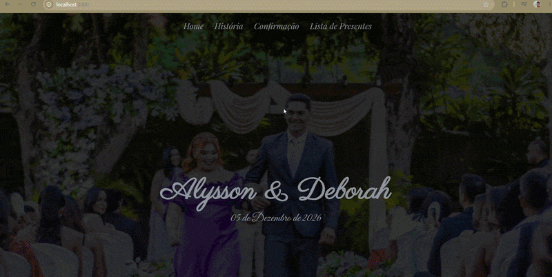
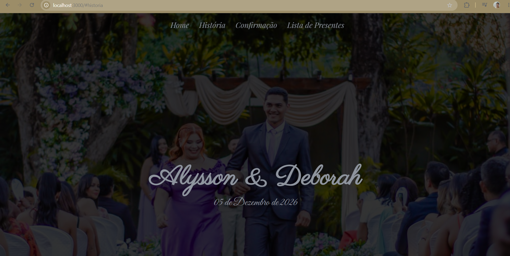
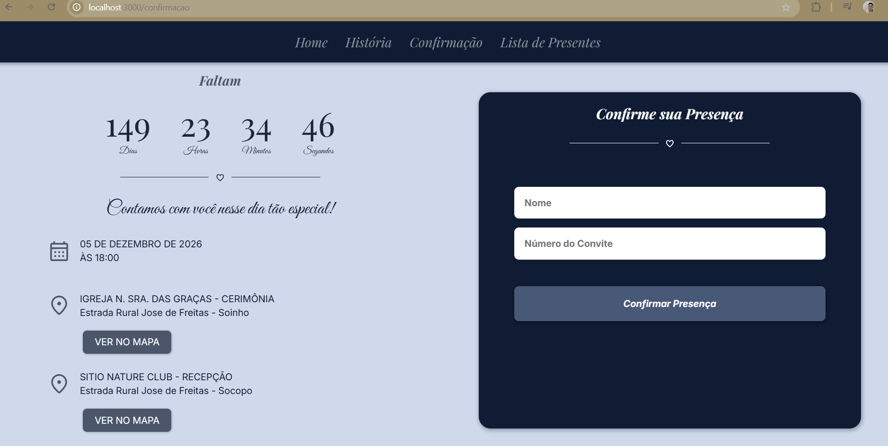
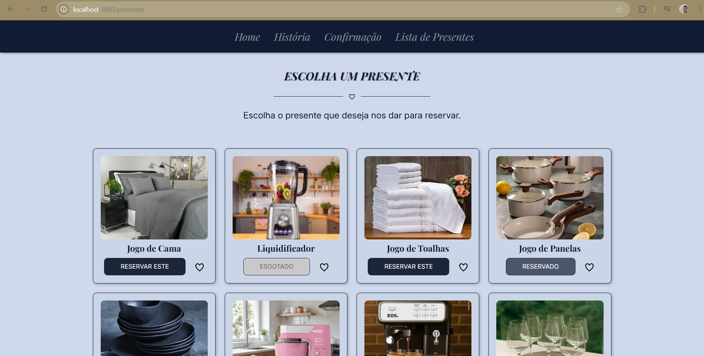

# Wedding Alysson & Deborah

Aplicação web Full Stack desenvolvida para gerenciamento de confirmações de presença (RSVP) e reserva de presentes de casamento.

O projeto foi desenvolvido com o objetivo de consolidar conhecimentos em desenvolvimento Full Stack por meio da construção de uma aplicação real, aplicando conceitos como arquitetura em camadas, APIs REST, integração com banco de dados e organização de código.

---

## Demonstração

<p align="center">
  
</p>

---

## Visão Geral

O Wedding Alysson & Deborah é uma aplicação desenvolvida para auxiliar no gerenciamento de convidados e da lista de presentes de um casamento.

Além de oferecer uma experiência simples para os convidados, o projeto foi construído buscando aplicar boas práticas de desenvolvimento de software, priorizando organização, separação de responsabilidades e facilidade de manutenção.

Durante o desenvolvimento, cada funcionalidade foi implementada pensando não apenas em resolver um problema imediato, mas também em preparar a aplicação para evoluções futuras.

---

## Capturas de Tela

### Página Inicial



---

### Nossa História


---

### Confirmação de Presença



---

### Lista de Presentes



---

## Stack Tecnológica

| Camada | Tecnologias |
|---------|-------------|
| Frontend | HTML5 • CSS3 • JavaScript |
| Backend | Node.js • Express.js |
| Banco de Dados | PostgreSQL |
| Versionamento | Git • GitHub |

---

## Arquitetura

O backend foi organizado seguindo uma arquitetura em camadas, buscando separar responsabilidades e facilitar a evolução da aplicação.

```text
Frontend
     │
     ▼
Express.js
     │
     ▼
Routes
     │
     ▼
Controllers
     │
     ▼
Services
     │
     ▼
Repositories
     │
     ▼
PostgreSQL
```

Essa estrutura torna o projeto mais organizado, facilita a manutenção do código e permite adicionar novas funcionalidades sem comprometer a arquitetura existente.

---

## Funcionalidades

- Página inicial responsiva.
- Sessão com a história do casal.
- Contador regressivo para o casamento.
- Sistema de confirmação de presença (RSVP).
- Validação das informações enviadas pelo usuário.
- API REST para comunicação entre frontend e backend.
- Integração com PostgreSQL.
- Listagem dinâmica de presentes.
- Reserva de presentes.
- Tratamento de erros e respostas da API.

---

## Como executar o projeto

Clone o repositório.

```bash
git clone https://github.com/WandrewRicardo/wedding-alysson-deborah.git
```

Acesse a pasta do projeto.

```bash
cd wedding-alysson-deborah
```

Instale as dependências.

```bash
npm install
```

Configure a conexão com o PostgreSQL conforme o ambiente local.

Inicie a aplicação.

```bash
npm start
```

Após iniciar o servidor, acesse:

```
http://localhost:3000
```

---

## Roadmap

### Versão 1.0

- ✅ Página inicial
- ✅ Sistema RSVP
- ✅ API REST
- ✅ Integração com PostgreSQL
- ✅ Reserva de presentes
- ✅ Arquitetura em camadas

### Próximas versões

- Painel administrativo.
- Sistema de autenticação.
- Dashboard de gerenciamento.
- Envio automático de e-mails.
- Melhorias de desempenho.
- Novas funcionalidades para gerenciamento dos presentes.

---

## Aprendizados

Este projeto representou um passo importante na minha evolução como desenvolvedor.

Durante sua construção, tive a oportunidade de aprofundar conhecimentos em desenvolvimento Full Stack, APIs REST, arquitetura em camadas, integração com banco de dados relacionais e organização de aplicações backend.

Mais do que implementar funcionalidades, este projeto reforçou uma visão que considero essencial no desenvolvimento de software: uma aplicação de qualidade não deve apenas funcionar, mas também ser organizada, compreensível e preparada para evoluir.

Foi justamente essa mentalidade que guiou cada etapa do desenvolvimento da versão 1.0.

---

## Autor

**Wandrew Ricardo**

Estudante de Ciência da Computação

Desenvolvedor Full Stack em Formação

- GitHub: https://github.com/WandrewRicardo
- LinkedIn: https://www.linkedin.com/in/wandrew-ricardo-61642a322